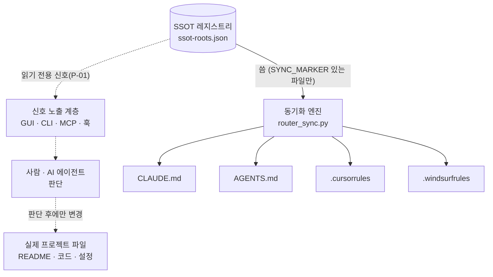

# SSOT Explorer

[](https://github.com/yhs01103-png/SSOT_EXplorer_index/actions/workflows/tests.yml)
[](.github/workflows/tests.yml)
[](LICENSE)

여러 프로젝트, 여러 AI 코딩 툴(Claude Code/Cursor/Windsurf/Copilot)을 같이
쓰다 보면 규칙 파일이 툴마다 따로 놀고 조용히 낡는다 — 한쪽만 고치고
나머지는 잊어버리는 식으로. SSOT_Explorer는 이 문제를 "레지스트리 JSON
하나만 진짜 소스로 두고, CLAUDE.md/AGENTS.md/Cursor/Windsurf 규칙파일
4종은 전부 거기서 찍어내는 산출물로 격하"시켜서 없앤다. 여기에 Claude
Code 세션이 열릴 때마다 레지스트리를 직접 재확인해 컨텍스트를 주입하는
훅, 그리고 어떤 MCP 지원 IDE에서든 같은 신호를 받을 수 있는 MCP 서버가
얹혀 있다.

GUI는 Windows 탐색기 대체 겸용 — 각 폴더의 CLAUDE.md/README.md 내용을
트리 옆에서 바로 볼 수 있고, `.cursor/rules/`·`.windsurf/rules/`(레거시
`.cursorrules`/`.windsurfrules`는 이미 있을 때만, D-036)까지 4종 동시
동기화도 여기서 바로 실행한다.

## 아키텍처 한눈에



레지스트리가 직접 쓰는 건 위쪽 4개 규칙파일뿐(계약이 있을 때만) — 나머지는
전부 신호만 내보내고, 실제 프로젝트 파일이 바뀌는 건 항상 그 신호를 받은
사람/에이전트가 따로 판단한 뒤다. 전체 흐름과 상용 제품(Backstage/Cortex/
Cursor 계열) 대비 정밀 비교는 아래 두 문서에 더 깊게 있다.

**[읽기전용 웹 데모](https://yhs01103-png.github.io/SSOT_EXplorer_index/)**
— 클론/설치 없이 실제 GUI와 개발자 탭이 어떤 모습인지 예시 데이터로 바로
보는 정적 페이지(`docs/index.html`). 라벨 폴더 감사 카운트다운은 방문
시점의 실제 날짜로 실시간 계산돼서, D-073의 "세션마다 재계산" 메커니즘이
그대로 재현된다.

## 설계 하이라이트

- **원자적 쓰기 + 낙관적 동시성 제어**(D-021) — 레지스트리가 OneDrive로
  여러 기기에 동기화되는 평범한 JSON 파일이라, `temp 파일 쓰기 → os.replace()`
  로 원자성을 보장하고 저장 직전 디스크 해시를 재확인해 "다른 기기가 먼저
  저장했으면 조용히 덮어쓰지 않고 멈춘다"(`RegistryConflictError`).
- **추측 대신 실측으로 반복한 분류 로직**(D-030→D-033) — 실제 질의로
  테스트해보니 정답 후보가 5순위로 밀리는 걸 발견(`floor` 방식 병합의
  결함), 원인을 IDF 공유+additive 병합으로 고친 뒤 같은 질의로 재검증해서
  개선을 수치로 확인 — "그럴듯해 보이는" 설계가 아니라 실행 결과로 다음
  결정을 내리는 방식을 스스로 계속 적용.
- **신호와 실행의 엄격한 분리(P-01)** — MCP 서버의 tool 7개는 전부 읽기
  전용이다(개발자모드 게이팅까지 포함, D-057). "이 폴더가 낡았다"는 신호는
  주지만 README를 대신 고쳐 쓰지 않는다 — 자동화를 넓히는 대신 어디까지가
  안전한 자동화인지 경계를 계속 명시적으로 지켰다.

## 아키텍처 분석 & 로드맵

코드만 보면 안 드러나는 "왜 이렇게 설계했는지"를 정리한 두 문서:

- **[SSOT_Explorer 해부도](https://claude.ai/code/artifact/5735551f-d123-4276-9ab9-bac4dc393bef)** —
  레지스트리→동기화/분류/노출/피드백 전체 데이터 흐름 + Backstage·Cortex·
  Cursor 계열 상용 제품과의 정밀 비교분석(강점/약점 둘 다 포함).
- **[상용화 청사진](https://claude.ai/code/artifact/6279b656-5fe6-4475-b9d8-21b2150959e2)** —
  개인 로컬 도구를 실제 제품으로 전환한다면 거쳐야 할 7단계 아키텍처
  로드맵(데이터 계층→인증/RBAC→실시간 동기화→...) + Phase 2(인증/RBAC)
  상세 스키마·권한 모델 설계.

## 설치 — CLI(전역, GUI 없이)

`ssot` 커맨드는 GUI(PySide6) 없이 동작한다(D-068~D-070) — `pipx`로 설치하면
다른 파이썬 프로젝트와 의존성이 안 섞인 채로 전역에서 바로 쓸 수 있다:

```bash
pipx install .          # 이 폴더에서, 또는 git+https://... 로 원격 설치
ssot --help
ssot register <path> --label <name>   # 새 프로젝트 루트 등록
ssot classify "이 텍스트가 어디 것인지"  # 기본은 빠른 1단계(오프라인)
ssot classify "..." --full             # 6단계 전체(시맨틱 포함, 느릴 수 있음)
ssot sync <label>                      # CLAUDE.md/AGENTS.md/Cursor/Windsurf 동시 갱신
ssot init [path]                       # 등록 후보 폴더만 나열(자동 등록 안 함)
```

기능별로 선택 설치 가능(전부 선택지 `[all]`이면 GUI+시맨틱+MCP 전부):

| extras | 뭐가 늘어나는지 | 언제 필요 |
|---|---|---|
| (기본) | jsonschema, kiwipiepy만 | `ssot` CLI 전체(classify 기본 경로 포함) |
| `semantic` | fastembed(ONNX, ~0.2GB) | `ssot classify --full`의 시맨틱 단계(D-067) |
| `gui` | PySide6 | `ssot-gui`(아래 GUI 실행)와 `main.py` |
| `mcp` | mcp SDK | Claude Code/Cursor 등 MCP 연동(`ssot-mcp`) — GUI 없이 단독 동작(D-071) |
| `all` | 위 전부 | "일단 다 되게" |

```bash
pip install ".[semantic]"   # classify --full까지
pip install ".[all]"        # 전부
```

## 실행

- 배포용: `dist\SSOT_Explorer.exe` 더블클릭(설치 불필요, 단일 실행파일)
- 개발용: `pip install -r requirements.txt` 후 `python main.py`
- exe 재빌드: `pip install -r requirements-dev.txt` 후
  `python -m PyInstaller --noconfirm --windowed --onefile --name "SSOT_Explorer" --collect-all kiwipiepy_model --collect-all kiwipiepy main.py`
  (D-034 — `--collect-all` 2개 필수. kiwipiepy는 언어모델 데이터 파일이
  따로 있어서, 이 플래그 없이 빌드하면 PyInstaller가 모델 파일을 안
  담아서 exe 안에서 조용히 예전 정규식 토크나이저로 폴백됨 — 앱은 안
  죽지만 분류 정밀도가 떨어짐. exe 용량이 기존 대비 훨씬 커짐(~150MB,
  모델 파일 포함)이 정상.)
- **회귀 테스트**(2026-08-13 도입, D-024 — Lazzy_App_OS_Monorepo/server의
  `test_*.py`+pytest 컨벤션 이식): `pip install -r requirements-dev.txt` 후
  `pytest -q`. `test_main.py`가 레지스트리 로드/저장, D-021 원자적쓰기+동시성
  충돌감지, D-023 primarySource, 툴바/단축키 등을 실제 사용자 레지스트리·
  QSettings를 안 건드리는 격리된 임시 경로에서 검증한다 — 코드 고칠 때마다
  스크래치 테스트를 새로 써서 지우는 대신 여기 추가해서 계속 쌓아간다.

## 기능

- 좌측: 트리(지연 로딩, 폴더+파일 전부 표시, `.claude` 폴더도 노출) —
  CLAUDE.md/README.md 있는 폴더는 굵게. 등록된 루트 밑에 **전체 드라이브**
  (C:\, D:\ 등)도 최상위로 노출(2026-08-13, D-028) — 등록 안 된 폴더도
  탐색기 대신 이 트리에서 바로 찾아갈 수 있음(내용은 펼칠 때만 읽음, 앱
  켤 때 미리 스캔 안 함)
- 우측: 선택한 폴더의 CLAUDE.md/README.md를 마크다운으로 렌더링해서 표시.
  그 위에 **관계 패널**(D-028) — 선택한 폴더가 레지스트리 `relations`에
  걸리면(등록된 루트든 아니든) "🔗 연관된 인덱싱 폴더 + 이유"를 보여줌,
  더블클릭하면 그 폴더로 트리가 이동. 관계 없으면 자동으로 숨겨짐
- 상단 검색창(Ctrl+F로 포커스): 이름으로 재귀 검색(백그라운드 스레드라 큰
  루트에서도 UI 안 멈춤) → 결과 더블클릭 시 트리에서 그 위치로 이동
- **+ 루트 추가 / − 루트 삭제 / 새로고침(F5)**: 레지스트리 갱신 + 새 루트는
  등록 즉시 init CLAUDE.md 자동 생성. 트리에서 루트 선택 후 Delete 키로도
  삭제 가능(하위 폴더 선택 시엔 동작 안 함 — 오조작 방지)
- **앱 시작 시 전체 루트 자동 init**(2026-08-14, D-031): 등록된 루트 중
  init CLAUDE.md가 아예 없는 것만 골라 자동 생성 — 손편집이든 이미 있는
  파일이든 절대 안 건드림.
- **SessionStart 훅**(`~/.claude/hooks/ssot_session_context.py`, D-031,
  SSOT_Explorer 앱과 별개로 항상 동작): Claude Code를 등록된 SSOT 루트
  (또는 그 하위)에서 열면, 그 폴더에 CLAUDE.md가 있든 없든 최신이든
  아니든 상관없이 레지스트리를 직접 읽어 owner/scope/리뷰상태/관련폴더를
  세션 시작 시 바로 주입. 파일 동기화가 밀려 있어도 Claude Code만큼은
  항상 최신 정보를 봄.
- **선택 루트 동기화 (AI 툴별)**: 다이얼로그에서 CLAUDE.md/AGENTS.md/
  .cursorrules/.windsurfrules 중 골라서(또는 전체 한번에) 같은 참조조건으로
  동기화. 손으로 쓴 파일은 확인 후에만 덮어씀. "리뷰 완료로 표시" 버튼도 여기.
- **전체 내보내기**: 등록된 모든 루트의 CLAUDE.md를 참조조건 전문 포함
  완전판으로 — 레지스트리/앱 없이도 동작하게 만드는 스냅샷
- 더블클릭: 폴더는 탐색기로, 파일은 기본 프로그램으로 엶
- 우클릭: 탐색기로 열기 / VS Code로 열기 / 터미널 열기 / **여기서 Claude Code
  실행**(cd 후 `claude` 바로 실행) / 경로 복사 / 웹 아티팩트 열기(등록돼
  있으면) — 결과는 하단 상태바에 표시
- **개발자 탭**(상단 "탐색기"/"개발자" 대분류, D-047 — 예전엔 툴바로 여는
  모달 "관리자 패널"이었다가 상시 탭으로 승격, 탭을 볼 때마다 자동
  새로고침): 루트별 owner/scope/리뷰 경과일(180일 초과 시 ⚠️) 포함 정리된
  레지스트리 뷰, **스키마 검증**(D-038 — 필수 필드 누락/타입 오류를 JSON
  Schema로 검증해서 표시, jsonschema 미설치 시 건너뜀 안내), "지금 드리프트
  체크 실행"(실시간 진행상황 스트리밍)
- 창 크기/좌우 분할 비율/마지막 선택 위치를 다음 실행 때 그대로 복원(QSettings)
- **오류 로깅**(2026-08-13, D-025): 미처리 예외는 `~/.claude/scripts/
  ssot_explorer.log`에 기록되고 사용자에게 다이얼로그로 알림 — exe가
  `--windowed`(콘솔 없음)라 로그 파일 없이는 문제 진단이 불가능했음.
  버튼 클릭 같은 슬롯 안 예외는 알림만 뜨고 앱은 계속 실행됨.
- **새 문서 저장**(툴바, D-029~D-034): 텍스트를 붙여넣으면
  `router_orchestrator.py`가 3단계 캐스케이드로 등록 루트 중 맞는 곳을
  제안 — (1) `router_classifier.py`: 레지스트리 label/referenceCondition
  키워드겹침(IDF 가중치, D-033) + scope 리터럴매치(Lazzy_App_OS_Monorepo의
  user_info_indexer.py 다중신호 구조를 실제로 읽고 이식) (2) 등록 루트
  README.md를 그 자리에서 실시간 스캔(레지스트리로 복사 안 함 — README는
  항상 그 폴더에만 있다는 원칙 유지), 같은 IDF 가중치 공유 (3)
  `router_proposals.py`의 신뢰 폐루프(confidence_calibrator.py 이식, 연속
  5승인→승급/1회거부로 즉시 강등) 주석. 토크나이저는 kiwipiepy(한국어
  형태소 분석기, D-034) — 명사류만 신호로 남기고 조사/어미/동사 활용은
  자동 제외("프로젝트를"/"프로젝트가"가 같은 토큰으로 통합됨), 미설치
  환경에선 정규식 방식으로 자동 폴백. 여러 루트에 흔한 단어("코드"/
  "프로젝트")는 IDF로 가중치를 낮추고, "내용"/"대화" 같은 요청 형식
  명사는 불용어로 걸러냄(D-033/D-034). AI 없는 휴리스틱 v1 — 여전히
  완벽하진 않음(정직한 실측 기록은 결정이력 D-033/D-034 참고). 사용자가
  후보+파일명을 고르고 "저장" 버튼을 눌러야만 실제로 파일이 써짐 —
  SSOT_Explorer 전체에서 새 파일을 쓰는 유일한 지점(P-01의 조건부 예외,
  아래 참고). 승인/취소는 `router_proposals.py`가 기록, 신뢰됨 후보는
  "✅신뢰됨" 배지(승급해도 승인 절차 자동 생략은 안 함).
- **키워드 레지스트리**(D-044 — "맥락형 인덱싱" 1단계, Lazzy keyword_
  registry.py 경량 이식): 분류에 실제로 쓰인 키워드(아무 단어나 아니라
  matchedKeywords만)를 관측해서, 5회 이상 그리고 3일 이상에 걸쳐 반복
  관측되면 자동으로 "활성" 승급 — 활성 키워드가 다시 매치되면 점수
  보너스를 받는다(관리자 패널에서 현황 확인 가능). **임베딩(시맨틱 매칭)
  은 아직 틀만**(`router_embeddings.py`, O-009) — 프로바이더(Gemini 등)를
  붙이려면 API 키+네트워크 호출이 필요해서, 이 프로젝트가 D-034부터
  지켜온 완전 오프라인 원칙을 깨는 결정이라 사용자 승인 전까진 순수
  계산 로직(코사인 유사도)만 미리 구현해두고 실제 연결은 안 함.
- **Inbox 감시**(툴바, D-042 — O-006 경량판): 폴더 하나를 골라 새 파일이
  생기면 상태바 알림 + `ssot_watcher_log.json`에 기록. **분류 제안/자동
  저장과는 연결 안 함** — 순수 감지+기록만(휴리스틱 분류기 정확도가 실사용
  데이터로 검증되기 전까진 자동 파이프라인을 안 잇는다는 원칙 유지, O-006
  본 비전은 계속 보류). 새 의존성 없이 폴링(`router_watcher.py`)만으로
  구현, 관리자 패널에서 최근 로그 확인 가능.
- **CLI 진입점**: `python router_orchestrator.py --text "..."`(3단계 전부
  거친 최종 결과, D-032 권장) 또는 `router_classifier.py --text "..."`
  (구조화 신호만, 더 빠름, D-030) — GUI 없이 아무 Claude Code 세션에서나
  직접 호출 가능, `--registry` 생략 시 기본 레지스트리 위치. "대화 내용을
  규칙으로 정리해줘" 같은 요청을 받았을 때 이걸로 목적지 후보를 먼저
  조회하고, 그 루트의 `referenceCondition`을 읽어 기존 컨벤션에 맞춰
  작성하는 용도. 매 오케스트레이터 실행은 `~/.claude/scripts/
  ssot_orchestrator_log.json`에 단계별 이력으로 기록됨.
- **SessionStart 훅 보강**(D-032): `ssot_session_context.py`가 발동할
  때마다 relations 명시 여부와 무관하게 "다른 등록 루트 전체" 목록과
  오케스트레이터 CLI 호출법을 항상 같이 안내.
- **세션 컨텍스트 로깅**(D-045 — "맥락형 인덱싱" 기반 단계): 위 훅이 실제로
  컨텍스트를 주입할 때마다 어떤 루트가 매치됐는지를 `~/.claude/scripts/
  ssot_session_context_log.json`에 가볍게 기록(이 앱은 관리자 패널에서
  읽기만 함). router_proposals(제안 승인율)/router_keyword_registry(키워드
  활성화)와 함께 "실사용 데이터를 먼저 모아서 다음 투자를 결정한다"는
  원칙의 세 번째 축.
- **개발자 콘솔**(D-046, 스켈레톤): `python dev_console_server.py`로 로컬
  웹서버 실행(`http://127.0.0.1:8765/`) — 관리자 패널과 같은 4개 데이터
  (스키마 검증/Inbox 감시 로그/키워드 레지스트리/세션 컨텍스트 로그)를
  브라우저로도 볼 수 있음. Lazzy_App_OS_Monorepo의 개발자 콘솔(D-SERVER-092)
  과 같은 발상이지만 서버 배포가 없는 로컬 데스크톱 앱이라 새 의존성 없이
  stdlib `http.server`만 사용, 인증 없음(기본 `127.0.0.1` 전용). **아직
  main.py UI에 시작 버튼은 없음**(O-010 — 코드는 동작하지만 통합은 보류).
- **MCP 서버**(D-048, "범용 IDE 플러그인" 방향): `python ssot_mcp_server.py`
  로 stdio transport 실행(공식 `mcp` SDK). 파일 조작은 절대 안 함 — Claude
  Code/Cursor/Windsurf 등 MCP를 지원하는 IDE/에이전트가 이 서버의 tool을
  불러서 "신호"만 받고, 실제 조치는 그쪽이 한다는 게 핵심(P-01 그대로
  유지). 지금은 tool 6개: `list_ssot_roots()`(등록 루트 목록 — 각 항목에
  `pathExists`도 포함, D-052 — 폴더가 삭제/이동됐으면 false, 자동 등록해제는
  안 함),
  `check_readme_freshness(root_label?, stale_days=30)`(README.md가 폴더 안
  다른 파일들의 최신 수정시각 대비 며칠 뒤처졌는지 — git 없는 루트라 커밋
  이력 대신 mtime 기반), `classify_content(text)`(D-050 — "맥락형 인덱싱"을
  MCP로 노출, 기존 `router_orchestrator.orchestrate()` 5단계 파이프라인을
  그대로 재사용해 텍스트가 어느 등록 루트에 속할지 순위 매김),
  `list_triggered_actions(root_label, changed_paths)`(D-058, O-013, D-061 —
  "액션 레지스트리". 루트가 `actions: [{trigger, policy, scriptPath?,
  prompt?}]`를 선언해두면(스크립트 실행이든 순수 자연어 규칙이든 최소 하나)
  changed_paths와 trigger(fnmatch 글롭)가 매치되는 것만 신호로 반환 — 실행
  여부/자동·승인 판단은 전부 호출한 에이전트 몫),
  `list_registered_actions(root_label?)`(D-061 — 매칭 없이 등록된 actions
  전체를 그대로 조회, "지금 뭐 등록됐는지 보여줘" 용도),
  `list_missing_index_folders(root_label)`(D-060 — 등록 루트 바로 밑(depth=1)
  에서 CLAUDE.md/README.md가 없는 하위 폴더를 후보로 반환. dot-폴더/흔한
  의존성 디렉토리는 제외, 실제로 그 폴더가 자기만의 규칙이 필요한지·뭘 써야
  하는지는 호출한 에이전트 판단 — README 자동생성은 여전히 안 함). **Claude
  Code에 프로젝트 스코프로 등록·연결 확인 완료**(D-049, 저장소 루트
  `.mcp.json` — `${CLAUDE_PROJECT_DIR:-.}` 사용, 개인 절대경로 없음 — `/mcp`로
  3개 tool 전부 연결 확인, 2026-08-17). **2026-08-17(D-062) — 추가로 사용자
  스코프(`claude mcp add -s user`)로도 등록** — 이제 어느 프로젝트에서
  Claude Code 세션을 열든(다음 새 세션부터, 이미 떠 있던 세션은 반영 안 됨)
  자동으로 연결된다(`claude mcp get ssot-explorer`로 `Scope: User config
  (available in all your projects)` 확인). 다른 MCP 지원 IDE(Cursor/Windsurf
  등)에는 아직 안 붙임(O-011, 필요성 미확인). MCP 경유 호출의 승인/거부
  신호를 어떻게 모을지는 아직 미정(O-012) — `list_triggered_actions`의
  `policy` 힌트는 이것과 별개(O-013 참고, 호출자가 스스로 판단하는 용도).

## 이 앱이 안 하는 것

- **파일 변경 감지(드리프트) 상시 감시**: 앱 자체는 백그라운드 감시 안 함 —
  별도 스크립트(`~/.claude/scripts/ssot_index_drift_check.py`, 순수 Python,
  Windows 작업 스케줄러가 매일 09:00 실행)와 훅 스크립트
  (`~/.claude/hooks/ssot_index_reminder.py`)가 담당. 둘 다 2026-08-13부로
  PowerShell(.ps1)에서 순수 Python으로 교체 — 크로스플랫폼(Windows/Mac/Linux)
  이고, exe 없이 `python3`만 있으면 동작. 옛 .ps1 파일은 참고용으로만 보존
  (더 이상 자동 실행 안 됨). 앱의 "지금 드리프트 체크 실행"은 이 스크립트를
  대신 실행해줄 뿐(보너스 기능).
- **README.md 생성/편집**: 안 함 — README는 각 프로젝트의 실제 규칙이라
  건드리지 않음. 레지스트리엔 "언제 여는지" 짧은 참조조건만 유지.
- **자유 폴더에 임의로 규칙파일 생성**: 안 함 — 생성/동기화는 **등록된 루트만**
  대상. 프로젝트 자체 CLAUDE.md는 여전히 사람/Claude Code가 직접 작성.
- **파일 복사/이동/삭제/이름변경(자동)**: 안 함(P-01, 고위험이라 의도적으로
  제외) — 2026-08-13(D-029)부터 유일한 예외는 "새 문서 저장" 다이얼로그의
  신규 파일 쓰기뿐이고, 그마저도 매번 사용자가 승인 버튼을 눌러야만
  실행됨. 기존 파일 이동/삭제/이름변경은 여전히 전면 안 함.

## 레지스트리(`ssot-roots.json`) — 단일 소스

이 앱, 드리프트 스크립트, 훅 스크립트가 전부 파일 하나를 공유해서 읽고
쓴다. 위치는 `SSOT_REGISTRY_PATH` 환경변수로 지정 — 안 정해두면 범용
기본값 `~/.claude/ssot-roots.json`을 쓴다(2026-08-14, D-039 — 공개 저장소로
전환하면서 특정 사용자의 개인 폴더 하드코딩을 뺐다). 자기 컴퓨터에 맞는
위치를 한 곳에 고정해두고 싶으면 이 환경변수를 영구 등록해두면 된다(예:
Windows는 `setx SSOT_REGISTRY_PATH "C:\경로\ssot-roots.json"`). 각 루트 항목:

- `referenceCondition` — 실질적 규칙 SSOT(프로즈). CLAUDE.md/AGENTS.md/
  Cursor/Windsurf(신·구 포맷 전부, D-036) 이걸로 동기화됨(포인터 모드 — 내용은
  항상 레지스트리 확인, 파일엔 복붙 안 함. "전체 내보내기"만 예외적으로 전문을 박음)
- `readmeReferenceCondition` — README.md는 안 건드리되, 언제 여는지의 요약
- `webArtifactUrl` — claude.ai 아티팩트 등 웹 문서 URL(있으면)
- `primarySource` — `"local"`(기본) | `"web"`. `"web"`이면 `webArtifactUrl`이
  **유일한 정본**이고 로컬 참조조건은 참고용 스냅샷일 뿐 — init/전체내보내기
  둘 다 그 사실을 문구로 명시하고, 동기화 다이얼로그에도 경고가 뜬다(Lazzy_
  App_OS_Monorepo가 문서 2개를 웹 전용으로 전환한 사례를 이식, D-023)
- `owner` / `scope` / `lastReviewed` — 프로즈+경량 스키마 하이브리드
  (Backstage catalog-info.yaml 방식). 도구가 검증 가능한 최소 필드만 —
  나머지는 계속 자유 프로즈
- **참조조건 수정은 Claude Code가**: 앱 UI로 편집하지 않음 — 대화 중 레지스트리
  JSON을 직접 고침
- **기존 손편집 내용 보호**: 사람이 이미 공들여 써둔 CLAUDE.md는 동기화
  마커가 없으므로, 동기화를 눌러도 확인창 없이는 안 덮어씀(D-010/P-05)

루트는 몇 개든 자유롭게 추가/삭제 가능(툴바 "+ 루트 추가") — 예: 개인
프로젝트 여러 개를 각각 하나의 루트로 등록해두고 이 앱 하나에서 오간다.

최상위 `relations`(D-028, 2026-08-13) — 루트 항목이 아니라 최상위 배열:
`{fromPath, toPath, reason, bidirectional}`. 등록된 루트든 그 밑 임의
폴더든 경로가 fromPath/toPath와 같거나 하위면 매치 — 트리에서 그 폴더를
클릭하면 관계 패널에 표시됨. dependsOnDocs와 같은 원칙(명시적 선언, 자동
스캔 안 함) — Claude Code가 대화 중 직접 채운다.

## 설계 문서

`SSOT_EXP_설계도\` 폴더 — 결정이력/TODO, 정책맵, 실행규격서, 상용/표준
비교분석 4파일(v1.0 단일 레포 구조).

가독성 재구성판 웹 아티팩트(정본은 위 md 파일, 아티팩트는 스냅샷, D-035):
- [인수인계 노트](https://claude.ai/code/artifact/1266df91-5b7d-435e-92ab-c5a8205bac68) — 구현도+D-058~D-062(액션 레지스트리) 이력+다음 세션용 프롬프트 (2026-08-18 갱신, 이전 링크 dead 확인 후 재발행)
- [상용/표준 비교분석](https://claude.ai/code/artifact/115070d7-977d-4f0c-8e4f-54786416af7b) — 축A/축B 판정 카드로 재구성
